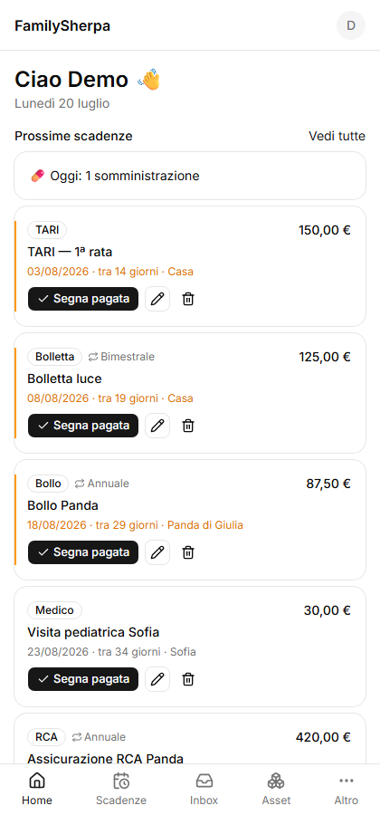
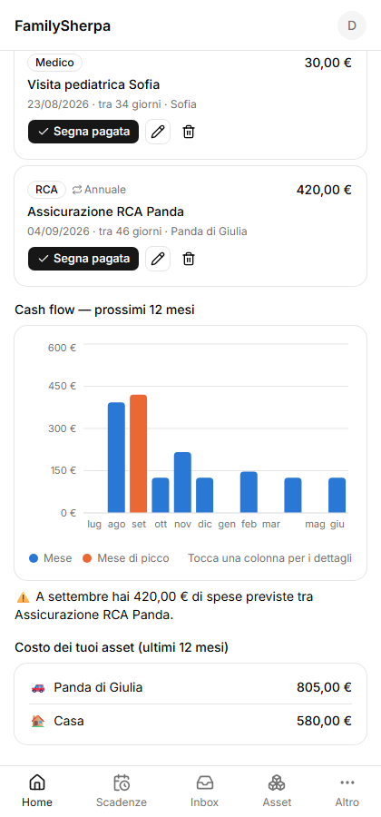
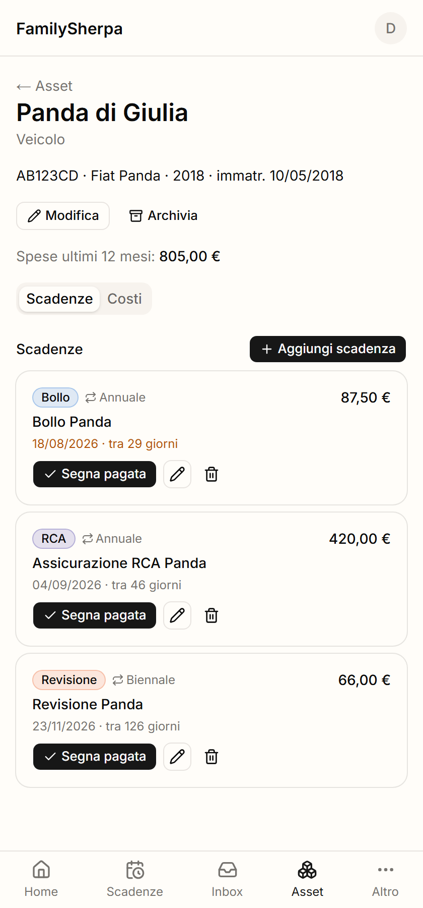
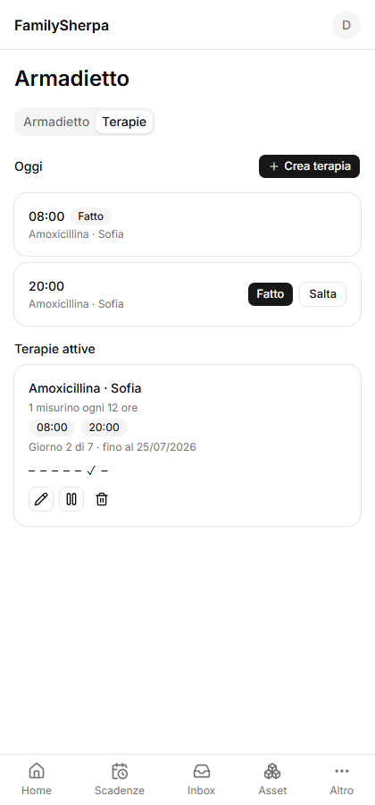

# 🏔️ FamilySherpa

**The open-source AI assistant that carries your family's mental load.**

Italian families juggle an absurd amount of recurring bureaucracy: bollo auto, revisione, RCA, TARI, PagoPA notices, ID card renewals, utility bills, pediatrician appointments, antibiotic schedules. FamilySherpa makes tracking all of it *passive*: you forward a voice note, a photo, or a PDF to a Telegram bot (or upload it in the app), and the AI extracts what it is, when it's due, how much it costs, and which family asset it belongs to. You tap **Conferma** and forget about it — the app remembers for you.

**The core loop works end to end**: send the bot a voice note, a photo, a PDF or a text message, and it comes back with what it understood plus one-tap confirm/cancel buttons; confirming writes real deadlines, expenses, therapies and medicines, which you can review and correct from the in-app Inbox, or manage by hand from the Asset, Scadenze and Armadietto screens (create/edit/archive assets, add deadlines with Italian smart defaults, mark them paid with automatic recurrence roll-over, photograph a medicine box or log a therapy and tick off each dose). The app then reminds you — via web push and Telegram — as deadlines and medicine doses come due, and the Home screen turns it all into foresight: a 12-month cash-flow forecast with a peak-spending callout, and each asset's real yearly cost. See [`CLAUDE.md`](CLAUDE.md) for the full architecture and conventions.

## Demo

| Home | Cash flow forecast |
|---|---|
|  |  |

| Asset deadline timeline | Medicine cabinet |
|---|---|
|  |  |

## Getting started

```
pnpm install
cp .env.example .env
# fill in .env — see SETUP.md for what each variable is and how to get it
pnpm db:generate && pnpm db:migrate
pnpm db:seed      # optional: populates a demo family with sample data
pnpm dev
```

Open `http://localhost:3000` — signed out, you'll land on the public welcome page; follow **Accedi** to sign in, or **Registrati** to create an account, then create a family (or join one with an invite code from `/settings`). `pnpm build && pnpm start` produces the installable production build.

Every variable in `.env.example` is validated at startup, so a missing one fails fast with its name. Two are new and easy to miss: **`ANTHROPIC_API_KEY`** (bring your own key — parsing is billed per message) and **`GROQ_API_KEY`** (free tier, transcribes voice notes; set `STT_PROVIDER=openai` + `OPENAI_API_KEY` to use OpenAI instead).

**Full step-by-step setup** (env vars, Turso, Telegram bot + tunnel, Windows gotchas) is in [`SETUP.md`](SETUP.md).

## MVP features

- **Inbound + AI parser** ✅ *working* — voice/photo/PDF/text via Telegram or in-app upload → Claude extracts deadlines, amounts, and asset associations → one-tap confirmation. Prompted specifically for Italian bureaucracy: bollo → annual, revisione → biennial, TARI instalments → separate deadlines, PagoPA codice avviso kept in the notes.
- **Asset hub** ✅ *working* — vehicles, people, home, and anything else, each with its own deadline timeline (bollo, revisione, RCA, documents, bills) and smart Italian recurrence defaults (bollo/RCA yearly, revisione every two years). Mark a deadline paid or done in one tap — it logs the expense and schedules the next occurrence for recurring ones.
- **Reminders** ✅ *working* — web push (installable PWA) and Telegram notifications as deadlines approach (30/7/1/0 days) and when a medicine dose is due, plus an optional custom reminder date on any deadline. Enable push per device from Settings; Telegram reminders arrive automatically once linked.
- **Expense dashboard** ✅ *working* — predictive 12-month cash flow with a peak-spending callout ("September: €800 between TARI and insurance"), and per-asset total cost of ownership with a category breakdown and manual expense entry.
- **Medicine cabinet** ✅ *working* — photograph a medicine box and it's recognized and tracked with its expiry date, which feeds the same reminder pipeline as any other deadline; "antibiotico bimba 2 volte al giorno per una settimana" schedules a therapy with per-dose reminders and a one-tap "fatto"/"salta" checklist.

## Stack

Next.js 16 (PWA) · Turso + Drizzle · Auth.js (email/password) · Claude API (BYOK) · Groq Whisper for speech-to-text · Telegram Bot API · deployed on Vercel.

Privacy: sensitive fields (codice fiscale, free-text medical notes) are encrypted at rest with an app-level key — the database is blind. Codice fiscale is never sent to the AI provider, and media (voice/photo/PDF) is processed in memory and never stored.

## License

[AGPL-3.0](LICENSE) — you can use, modify and self-host FamilySherpa freely; if you distribute a modified version or offer it as a network service, you must publish your source code under the same license.
