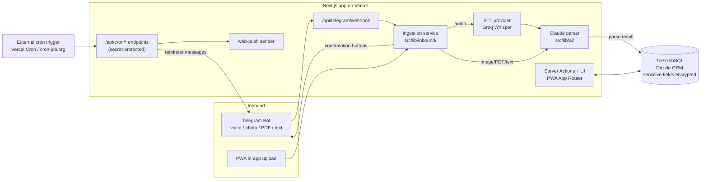

# 00 — FamilySherpa: overview, architecture and conventions

This document is the **shared context for every implementation session**. Every other spec assumes you have read it. It is intentionally the single place where stack, conventions, environment variables, and the domain glossary are defined — other specs reference this file instead of repeating it.

## 1. Vision

FamilySherpa removes the *mental load* of running an Italian family. The core bet: **data acquisition must be passive**. Nobody fills in forms after dinner. Instead:

1. A parent forwards a voice note ("ho prenotato il tagliando per giovedì"), a photo (the pediatrician's paper reminder), or a PDF (a PagoPA/TARI notice) to the family's **Telegram bot**, or uploads it in the PWA.
2. An LLM (Claude) — prompted specifically for **Italian bureaucracy** (PagoPA, TARI, bollo auto, revisione, RCA, codice AIC, ricette) — extracts *what*, *when*, *how much*, and *which family asset* it belongs to.
3. The user gets a confirmation message with **[✅ Conferma] [✏️ Modifica] [❌ Annulla]** buttons. On confirm, the item lands in the family's shared hub: deadlines, expenses, or medicine cabinet.
4. The app pays it back with **reminders** (push + Telegram) and **foresight** (predictive monthly cash flow, per-asset cost of ownership).

The project is **open source (AGPL-3.0)** and designed to be **self-hostable for free**: free tiers of Vercel + Turso + Telegram + Groq, bring-your-own Anthropic API key.

## 2. MVP scope

| In MVP | Deferred (post-MVP roadmap, §10) |
|---|---|
| Telegram bot + in-app upload (voice, photo, PDF, text) | WhatsApp Business channel |
| AI parsing pipeline with confirmation flow | Editing parsed items via chat conversation |
| Asset hub: vehicles, people, home + deadline timelines | Plate lookup on public vehicle databases |
| Recurring deadlines with Italian smart defaults | Zero-knowledge / client-side E2E encryption |
| Reminders: web push + Telegram | Email channel, calendar (ICS) export |
| Expense dashboard: predictive cash flow + asset TCO | Bank/CSV import |
| Medicine cabinet: box photo recognition, expiries, therapy reminders | Barcode/AIC scan against AIFA open data |

## 3. Architecture



Key architectural rules:

- **Channel abstraction.** All inbound sources implement the same flow: normalize incoming content → store an `inbox_messages` row → run the parsing pipeline → send a confirmation through the channel it came from. Telegram is the first channel; WhatsApp must be addable later by implementing the same interface (defined in spec 04) without touching the pipeline.
- **Everything runs inside the Next.js app.** No separate worker/queue for the MVP. Long tasks (STT + LLM ≈ 5–20 s) run inside the webhook/server action invocation; Vercel function `maxDuration` is raised where needed.
- **Scheduling is exogenous.** The app exposes idempotent, secret-protected `/api/cron/*` endpoints. *What* triggers them (Vercel Cron, cron-job.org, Upstash QStash) is a deployment choice documented in spec 10 — the app never assumes a specific scheduler.
- **Media bytes are not persisted in the MVP.** Voice/photo/PDF are processed in memory; we persist the transcription and the structured extraction. For Telegram media we also keep the `telegram_file_id` (re-downloadable later). This keeps storage free and reduces the sensitive-data surface.

## 4. Stack (fixed — do not substitute without user approval)

| Layer | Choice | Notes |
|---|---|---|
| Framework | **Next.js 15+** (App Router, TypeScript strict) | Server Actions for mutations; Route Handlers for webhooks/cron |
| UI | **Tailwind CSS v4** + **shadcn/ui** | Mobile-first; the PWA is used 95% on phones |
| PWA | **Serwist** (`@serwist/next`) | manifest, offline shell, web push |
| Database | **Turso** (libSQL) + **Drizzle ORM** | Local dev against a local SQLite file, prod against Turso |
| Auth | **Auth.js v5** (`next-auth@beta`) | Google OAuth provider, JWT session strategy, Drizzle adapter |
| LLM | **Claude API**, model from env `ANTHROPIC_MODEL` (default `claude-sonnet-5`) | Official `@anthropic-ai/sdk`; structured output via tool use |
| STT | Pluggable provider, default **Groq** (`whisper-large-v3-turbo`) | Interface in spec 05; OpenAI Whisper as alternative |
| Telegram | **grammY** | Webhook mode (no long polling — serverless) |
| Push | **web-push** (VAPID) | iOS ≥ 16.4 requires installed PWA |
| Charts | **Recharts** | Spec 08 |
| Validation | **Zod** | All external inputs (webhooks, forms, LLM output) are Zod-parsed |
| Tests | **Vitest** | Unit tests for pure logic (crypto, recurrence, parsers, CF decoding) |
| Deploy | **Vercel** + Turso cloud | Spec 10 |

Install exact current stable versions at implementation time; if a listed major version is no longer current, pause and ask the user.

## 5. Repository layout

```
src/
  app/                    # App Router
    (app)/                # authenticated app shell: dashboard, assets, inbox, meds, settings
    (auth)/               # sign-in, onboarding
    api/
      telegram/webhook/route.ts
      cron/…/route.ts
      push/…/route.ts
  components/             # shared UI (shadcn/ui in components/ui)
  db/
    index.ts              # drizzle client (Turso or local file)
    schema.ts             # ALL tables live here (spec 02)
  lib/
    crypto.ts             # field encryption (spec 02)
    ai/                   # LLM client, prompts, STT (spec 05)
    inbound/              # channel interface + ingestion pipeline (specs 04–05)
    reminders/            # recurrence + notification logic (spec 07)
    cf.ts                 # codice fiscale decoding (spec 06)
    utils.ts
  auth.ts                 # Auth.js config (spec 03)
drizzle/                  # generated migrations (committed)
docs/specs/               # these files
public/                   # PWA icons, manifest
```

## 6. Conventions

- **Language.** Code, comments, commit messages, README: **English**. UI copy, notification texts, LLM prompts and LLM few-shot examples: **Italian**. i18n framework is out of scope for the MVP — Italian strings are hardcoded (grouped in component-level constants where reuse helps).
- **Money** is always integer euro cents in a field named `amount_cents`. Format with `Intl.NumberFormat("it-IT", { style: "currency", currency: "EUR" })`.
- **Dates.** Due dates and date-only values: `YYYY-MM-DD` strings. Timestamps: ISO 8601 UTC. All user-facing scheduling logic (reminder hours, "today") uses timezone **`Europe/Rome`** — never the server's local time.
- **IDs**: `crypto.randomUUID()`, `text` primary keys.
- **Multi-tenancy.** Every domain row carries `family_id`. Every query in server actions/route handlers **must** filter by the current user's family (helper in spec 03). Treat a missing family scope as a security bug.
- **Encrypted fields** end with `_enc` and are encrypted/decrypted only through `src/lib/crypto.ts`. Encryption policy: **codice fiscale and all free-text notes fields are encrypted; structured operational fields (titles, dates, amounts, categories, plate numbers, medication names) are plaintext** so they remain queryable. Never log decrypted values.
- **Validation**: every webhook payload, form input, and LLM response passes through a Zod schema before touching the DB.
- **Errors**: server actions return `{ ok: true, data } | { ok: false, error: string }` (Italian, user-displayable `error`); never throw raw errors at the UI. Route handlers return proper HTTP codes and log with `console.error` including a request context prefix.
- **Env vars**: every variable exists in `.env.example` with a comment explaining where to obtain it. Access env only through `src/lib/env.ts` (a Zod-validated accessor created in spec 01).

## 7. Environment variable registry

Canonical list — specs reference these exact names. (Introduced by: spec in parentheses.)

| Variable | Purpose |
|---|---|
| `TURSO_DATABASE_URL`, `TURSO_AUTH_TOKEN` | Turso connection; in local dev URL may be `file:local.db` and token empty (01) |
| `AUTH_SECRET` | Auth.js JWT secret (03) |
| `AUTH_GOOGLE_ID`, `AUTH_GOOGLE_SECRET` | Google OAuth credentials (03) |
| `AUTH_ALLOWED_EMAILS` | optional, comma-separated; restricts who may **create** a new family (sign-up gate). Unset = open instance. Joining an existing family via invite code is never gated by this list (03) |
| `ENCRYPTION_KEY` | 32-byte base64 key for field encryption (02) |
| `ANTHROPIC_API_KEY` | Claude API key — BYOK (05) |
| `ANTHROPIC_MODEL` | optional, default `claude-sonnet-5` (05) |
| `STT_PROVIDER` | `groq` (default) or `openai` (05) |
| `GROQ_API_KEY` | STT default provider (05) |
| `OPENAI_API_KEY` | optional, only if `STT_PROVIDER=openai` (05) |
| `TELEGRAM_BOT_TOKEN` | from @BotFather (04) |
| `TELEGRAM_WEBHOOK_SECRET` | random string validated on webhook calls (04) |
| `CRON_SECRET` | bearer token for `/api/cron/*` (07) |
| `VAPID_PUBLIC_KEY`, `VAPID_PRIVATE_KEY`, `VAPID_SUBJECT` | web push (07); `NEXT_PUBLIC_VAPID_PUBLIC_KEY` mirrors the public key |
| `NEXT_PUBLIC_APP_URL` | canonical app URL, e.g. `https://familysherpa.vercel.app` (01) |

## 8. Domain glossary

| Term | Meaning |
|---|---|
| **Family** | The tenant. Users belong to exactly one family in the MVP (admin or member role). |
| **Asset** | Anything the family manages: `vehicle`, `person`, `home`, `other`. Deadlines and expenses attach to assets (or to the family directly). |
| **Deadline** | A future obligation: due date, optional amount, optional recurrence, category. The central domain object. |
| **Transaction** | A paid/incurred expense. Marking a deadline as paid creates a transaction (and, if recurring, the next deadline). TCO aggregates transactions; cash-flow forecast aggregates pending deadlines. |
| **Inbox message** | A raw inbound item (voice/photo/PDF/text) with its transcription, parse result, and status (`received → parsed → confirmed/rejected/failed`). |
| **Category** | Fixed enum for deadlines/transactions: `bollo`, `revisione`, `rca`, `tagliando`, `documento`, `bolletta`, `condominio`, `tari`, `medico`, `farmaco`, `abbonamento`, `altro`. |
| **Therapy** | A medication schedule for a person ("2 volte al giorno per 7 giorni") generating **intakes** — individual scheduled doses to be reminded and ticked off. |
| **Bollo / Revisione / RCA / TARI / PagoPA** | Italian domain: car ownership tax (annual) / mandatory vehicle inspection (first after 4 years, then every 2) / mandatory car insurance (annual or semiannual) / municipal waste tax (1–4 instalments/year) / national e-payment system for public administration notices. |

## 9. Definition of done (applies to every spec)

1. All acceptance criteria of the spec pass.
2. `pnpm lint`, `pnpm typecheck` (`tsc --noEmit`) and `pnpm test` pass.
3. New env vars are in `.env.example` with comments, and validated in `src/lib/env.ts`.
4. Pure logic introduced by the spec (crypto, recurrence math, CF decoding, prompt-output validation, etc.) has Vitest unit tests. UI and external integrations are tested manually — the session must end by telling the user **exactly what to test manually and how**.
5. No secrets committed; no `console.log` of decrypted sensitive data.
6. Conventional commit messages (`feat: …`, `fix: …`, `chore: …`).

## 10. Post-MVP roadmap (context for design decisions — do not implement)

- **WhatsApp channel** via Meta Cloud API / Twilio, as a second `InboundChannel` implementation.
- **Conversational editing**: "Modifica" handled in-chat instead of deep-linking to the app.
- **Vehicle plate lookup** (Portale dell'Automobilista has no official public API — would be best-effort).
- **AIFA open-data AIC lookup + barcode scanning** for the medicine cabinet.
- **Zero-knowledge mode**: client-side encryption with user-derived keys for users who accept losing server-side AI parsing on encrypted fields.
- ICS calendar feed, email digest, bank CSV import, multi-family support.

## Implementation prompt

This spec has no implementation session — it is context for all the others. Every implementation prompt in specs 01–10 starts with: *"Read `docs/specs/00-overview.md` first."*

Each spec's "Implementation prompt" section also states the **recommended model and reasoning effort** for its session (e.g. "Sonnet 5, high") — set them with `/model` before pasting the prompt. As a rule: Opus 4.8 for the specs with the subtlest logic (05, 07), Sonnet 5 elsewhere; high effort where exactness is critical (canonical schema, algorithms, webhooks), medium for prescriptive/boilerplate work.
